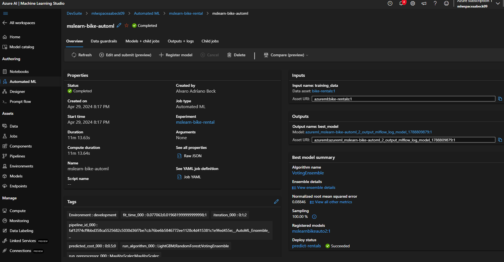

# azuremlws
### Azure Machine Learning Workspace

Para executar esse projeto em produção (última versão) eu usei o . Os script estão aqui no repositório.
Criei todos os objetos, incluindo o Container Registry para que fosse possível destruir 100% dos objetos, de forma automática, ao final do trabalho.

Depois segui os passos para a criação do Job automatizado e, então, o deploy do endpoint, tudo seguindo as instruções <a href="https://microsoftlearning.github.io/mslearn-ai-fundamentals/Instructions/Labs/01-machine-learning.html">desse link</a>.

### Os passos:

1. Os objetos criados:

    

2. O AutomatedML:

    

3. O modelo treinado:

    

4. O Algorítimo:

    

5. As métricas:

    

6. O Endpoint:

    

7. Todos os objetos que foram criados no processo:

    

## Em resumo
Foi um exercício muito bom porque aprendi bastente sobre a construção desse sistema e os relacionamentos entre os objetos e a sequência necessária para que fosse possível ter um resultado prático no final.